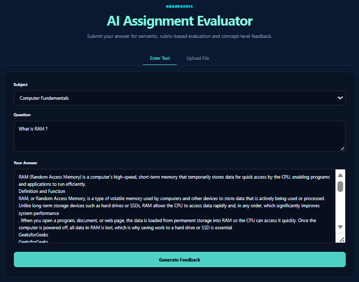
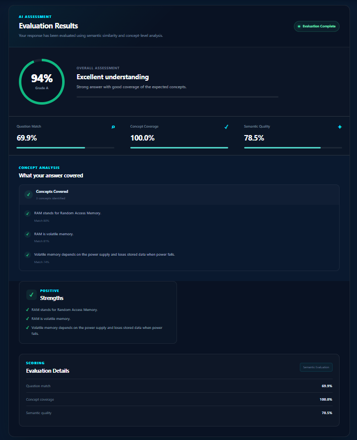

# GradeGenie — AI Semantic Assessment & Feedback Platform

GradeGenie is an AI-powered semantic grading platform that evaluates student answers against reviewed rubric concepts rather than relying on simple keyword matching.

The system combines **sentence embeddings**, **semantic similarity**, and **Natural Language Inference (NLI)** to determine whether expected concepts are covered, missing, or contradicted. It then produces a deterministic score and structured feedback through a React-based evaluation dashboard.

> GradeGenie is designed as an interpretable semantic assessment system: the final grade is derived from explicit rubric coverage and semantic quality rather than being generated directly by an LLM.

---

## ✨ Key Features

- 🧠 **Semantic Answer Evaluation**
  - Evaluates meaning rather than requiring exact keyword matches.
  - Handles paraphrased student responses.

- 📋 **Rubric-Driven Grading**
  - Evaluates answers against explicit rubric concepts.
  - Supports weighted concepts and `select_any` evaluation rules.

- 🔎 **Question-to-Rubric Matching**
  - Matches the submitted question against the reviewed rubric bank using sentence embeddings.

- 🛡️ **NLI-Based Verification**
  - Uses Natural Language Inference to distinguish supported concepts from contradictory statements.
  - Helps prevent semantically similar but factually incorrect answers from receiving full credit.

- 📊 **Deterministic Scoring**
  - Final grade is calculated using explicit scoring weights.
  - No LLM-generated grade is used as the final scoring mechanism.

- 💡 **Concept-Level Feedback**
  - Identifies:
    - Covered concepts
    - Missing concepts
    - Contradicted concepts

- 📝 **Actionable Feedback**
  - Provides strengths and areas for improvement.

- 📄 **Multiple Submission Formats**
  - Text answers
  - PDF documents
  - TXT files
  - PNG/JPG image submissions when OCR dependencies are available

- 🎨 **Interactive Evaluation Dashboard**
  - Overall grade
  - Question match
  - Concept coverage
  - Semantic quality
  - Concept analysis
  - Strengths
  - Areas for improvement

---

# 📸 Screenshots

## Answer Submission



The submission interface allows students to select a subject, enter a question, and provide their answer as text or upload a supported document.

---

## AI Evaluation Results



The evaluation dashboard presents the overall grade, semantic evaluation metrics, concept-level analysis, strengths, and areas for improvement.

---

# 🎯 Why GradeGenie?

Traditional automated grading approaches often rely heavily on:

- Exact keyword matching
- String similarity
- Matching against an entire reference answer

These approaches can fail when students express the same concept using different wording.

For example:

> Reference: "RAM is volatile memory."

A student might write:

> "RAM loses its contents when power is removed."

A keyword-based system may consider these statements different even though they communicate the same underlying concept.

GradeGenie instead represents expected answers as **rubric concepts** and evaluates the semantic relationship between those concepts and the student's response.

The system also considers the possibility that a student response may be semantically related while actually contradicting the expected concept.

---

# 🧠 How GradeGenie Works

The evaluation pipeline follows a multi-stage process:

```text
Student Question + Answer
            │
            ▼
      React Frontend
            │
            │ POST /api/evaluate
            ▼
      Flask Backend
            │
            ├───────────────┐
            │               │
            ▼               ▼
     Text Extraction    Question Matching
            │               │
            │               ▼
            │        Sentence Embeddings
            │               │
            │               ▼
            │        Best Matching Rubric
            │
            └───────────────┐
                            ▼
                    Rubric Concepts
                            │
                            ▼
                  Student Answer Candidates
                            │
                            ▼
                  Semantic Similarity
                            │
                     Related enough?
                       /          \
                     No            Yes
                     │              │
                     ▼              ▼
                  Missing       NLI Verification
                                    │
                         ┌──────────┼──────────┐
                         ▼          ▼          ▼
                     Entailment  Neutral  Contradiction
                         │          │          │
                         ▼          ▼          ▼
                      Covered    Missing   Contradicted
                         │
                         ▼
                 Concept Coverage
                         │
                         ▼
                  Semantic Quality
                         │
                         ▼
                 Deterministic Grade
                         │
                         ▼
                 Structured Feedback
                         │
                         ▼
                  React Dashboard
```

---

# 🔬 Evaluation Methodology

GradeGenie currently uses two primary scoring components.

## 1. Concept Coverage

Each rubric contains expected concepts with associated weights.

Concept coverage measures the proportion of the rubric that the student's answer correctly addresses.

Concepts can be classified as:

```text
covered
missing
contradicted
```

For normal rubric questions:

```text
Concept Coverage =
sum(weight of covered concepts)
```

The rubric system also supports `select_any` rules for questions where only a required number of concepts need to be covered.

For example:

```text
Required: 2 of 4 concepts

Student covers: 3 concepts

Result:
Full credit for the select-any group
```

---

## 2. Semantic Quality

Semantic quality measures how closely the student's matched statements correspond to the expected rubric concepts using embedding similarity.

Contradicted concepts do not contribute positive semantic quality.

This prevents a contradictory answer from receiving semantic credit simply because the wording happens to be similar.

---

## 3. NLI Verification

Semantic similarity alone is not sufficient for reliable assessment.

Consider:

```text
Expected:
"RAM is volatile memory."

Student:
"RAM is non-volatile memory."
```

The two statements are highly related in topic and vocabulary, but the student's claim contradicts the expected concept.

GradeGenie therefore uses NLI after the semantic similarity stage.

The NLI model classifies the relationship as:

```text
Entailment
Neutral
Contradiction
```

The resulting concept status is then used by the grading pipeline.

---

## 4. Final Grade

The current deterministic scoring formula is:

```text
Final Score =
    70% × Concept Coverage
  + 30% × Semantic Quality
```

The score is converted into a percentage grade.

The scoring weights are explicitly implemented in the backend rather than being generated by an LLM.

---

# 🤖 Machine Learning Models

## Sentence Transformer

```text
sentence-transformers/all-MiniLM-L6-v2
```

Used for:

- Question-to-rubric matching
- Semantic similarity
- Candidate concept matching

The model provides compact sentence-level embeddings suitable for lightweight semantic comparison.

---

## NLI Cross-Encoder

```text
cross-encoder/nli-MiniLM2-L6-H768
```

Used for:

- Entailment verification
- Contradiction detection
- Distinguishing related but incorrect statements

The semantic similarity stage acts as a first-pass filter before NLI verification.

This reduces unnecessary NLI inference while keeping the grading logic interpretable.

---

# 🧾 Rubric-Driven Evaluation

GradeGenie uses a reviewed rubric bank rather than treating an entire reference answer as a single similarity target.

A simplified rubric entry looks like:

```json
{
  "question": "Explain RAM.",
  "concepts": [
    {
      "text": "RAM is Random Access Memory.",
      "weight": 0.30
    },
    {
      "text": "RAM is volatile memory.",
      "weight": 0.35
    },
    {
      "text": "RAM loses stored data when power is removed.",
      "weight": 0.35
    }
  ]
}
```

Each concept can contain additional metadata such as:

- `weight`
- `tier`
- `evaluation_type`
- `select_any`

This makes the evaluation process more transparent and inspectable than a single reference-answer similarity score.

---

# 🏗️ System Architecture

```text
┌─────────────────────────────────────────────┐
│              React Frontend                 │
│                                             │
│  Submission UI → Evaluation Dashboard       │
└──────────────────────┬──────────────────────┘
                       │
                       │ HTTP / JSON
                       ▼
┌─────────────────────────────────────────────┐
│              Flask REST API                 │
│                                             │
│  /api/subjects                              │
│  /api/evaluate                              │
└──────────────────────┬──────────────────────┘
                       │
                       ▼
┌─────────────────────────────────────────────┐
│          Evaluation Pipeline                │
│                                             │
│  Text Extraction                            │
│       ↓                                     │
│  Question Matching                          │
│       ↓                                     │
│  Rubric Selection                           │
│       ↓                                     │
│  Semantic Matching                          │
│       ↓                                     │
│  NLI Verification                           │
│       ↓                                     │
│  Concept Classification                     │
│       ↓                                     │
│  Coverage + Semantic Quality                │
│       ↓                                     │
│  Deterministic Grade                        │
└─────────────────────────────────────────────┘
```

---

# 🛠️ Tech Stack

## Frontend

- React
- Vite
- React Router
- JavaScript
- CSS

## Backend

- Python
- Flask
- Flask-CORS
- NumPy

## Machine Learning

- Sentence Transformers
- `all-MiniLM-L6-v2`
- Cross-Encoder NLI
- `cross-encoder/nli-MiniLM2-L6-H768`

## Document Processing

- Pillow
- Tesseract OCR
- pdf2image / Poppler

These document-processing dependencies are optional and are only required for the corresponding file-processing workflows.

## Data

- JSONL reference/training data
- JSON rubric definitions

---

# 📁 Project Structure

```text
GradeGenie/
│
├── front-end/
│   ├── package.json
│   ├── package-lock.json
│   └── project/
│       ├── src/
│       │   ├── components/
│       │   ├── pages/
│       │   └── ...
│       └── ...
│
├── new-backend/
│   ├── final_app.py
│   ├── requirements.txt
│   └── rubrics_v5.json
│
├── docs/
│   └── screenshots/
│       ├── submission.png
│       └── evaluation-results.png
│
├── training_data.jsonl
├── .gitignore
├── LICENSE
└── README.md
```

> The exact frontend component structure may vary slightly depending on the current UI version.

---

# ⚙️ Prerequisites

Before running GradeGenie locally, install:

- Node.js 18+
- Python 3.10+

Optional dependencies for document processing:

- Tesseract OCR
- Poppler

---

# 🚀 Installation

## 1. Clone the repository

```bash
git clone https://github.com/PalankiMeghana/GradeGenie--AI-Semantic-Assessment-Feedback-Platform.git

cd GradeGenie--AI-Semantic-Assessment-Feedback-Platform
```

---

# 🐍 Backend Setup

Navigate to the backend:

```bash
cd new-backend
```

Create a virtual environment:

### Windows

```bash
python -m venv venv
venv\Scripts\activate
```

### macOS / Linux

```bash
python3 -m venv venv
source venv/bin/activate
```

Install dependencies:

```bash
pip install -r requirements.txt
```

Start the Flask backend:

```bash
python final_app.py
```

The backend should run at:

```text
http://localhost:5000
```

---

# ⚛️ Frontend Setup

Open a second terminal.

Navigate to the frontend:

```bash
cd front-end/project
```

Install dependencies:

```bash
npm install
```

Start the Vite development server:

```bash
npm run dev
```

The frontend should run at:

```text
http://localhost:5173
```

---

# 🧪 Using GradeGenie

1. Start the Flask backend.
2. Start the Vite frontend.
3. Open the frontend in your browser.
4. Select a subject.
5. Enter the question.
6. Enter your answer or upload a supported file.
7. Select **Generate Feedback**.
8. GradeGenie evaluates the response.
9. Review:
   - Overall grade
   - Question match
   - Concept coverage
   - Semantic quality
   - Covered concepts
   - Missing concepts
   - Contradicted concepts
   - Strengths
   - Areas for improvement

---

# 📊 Example Evaluation

A typical evaluation response can be represented as:

```text
Overall Grade
     94%
      A

Question Match
     94.8%

Concept Coverage
     100%

Semantic Quality
     78.5%
```

The dashboard then explains the result through concept-level feedback rather than presenting only a numerical grade.

---

# 🔍 Design Principles

GradeGenie was built around several principles.

### 1. Meaning over keywords

Students should not need to reproduce the reference answer word-for-word.

### 2. Correctness over similarity

Semantic similarity is useful for finding related statements, but similarity alone should not determine factual correctness.

### 3. Transparent scoring

The final grade should be explainable through explicit scoring components.

### 4. Concept-level feedback

A student should be able to understand what they covered and what they missed.

### 5. Deterministic evaluation

The scoring pipeline should produce reproducible results from the same rubric and answer.

---

# ⚠️ Current Limitations

GradeGenie is currently a portfolio/research project rather than a production academic grading system.

Known limitations include:

- Rubric quality directly affects evaluation quality.
- The current rubric bank covers a finite set of questions and concepts.
- Semantic thresholds require further calibration on a larger human-labeled dataset.
- NLI models can still make mistakes on domain-specific statements.
- OCR quality depends on document quality and the installed OCR/PDF dependencies.
- The current scoring weights are explicit initial values rather than weights learned from a large human-graded benchmark.
- The system should not be treated as a replacement for instructor judgment in high-stakes assessment.

---

# 🔮 Future Improvements

Potential future work includes:

- Larger human-labeled evaluation datasets
- Calibration of similarity and NLI thresholds
- Agreement analysis against human graders
- Precision/recall/F1 evaluation for concept classification
- More sophisticated clause-level evidence extraction
- Better support for domain-specific terminology
- More subjects and larger rubric banks
- Persistent evaluation history
- Instructor-side rubric creation
- Batch assignment evaluation
- Authentication and role-based access
- Production deployment
- Automated evaluation regression tests
- Model and rubric version tracking

---

# 📌 Project Status

**Current status:** Functional local full-stack prototype.

The core evaluation pipeline and interactive evaluation dashboard are implemented.

The project is primarily intended to demonstrate:

- Applied NLP
- Semantic similarity
- Natural Language Inference
- Rubric-based evaluation
- Deterministic scoring
- Full-stack ML application development

---

# 📄 License

This project is licensed under the MIT License.

See [`LICENSE`](LICENSE) for details.

---

# 👩‍💻 Author

**Meghana Palanki**

GitHub:  
https://github.com/PalankiMeghana

Project Repository:  
https://github.com/PalankiMeghana/GradeGenie--AI-Semantic-Assessment-Feedback-Platform
